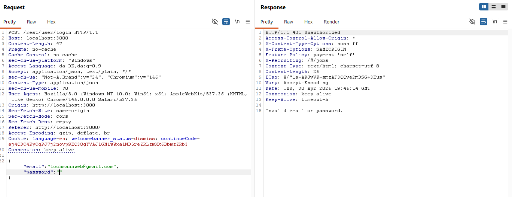
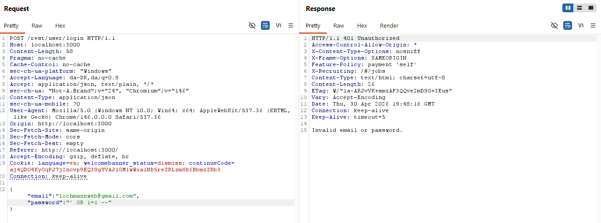

## Authentication Testing

### Login Request

I intercepted the login request:

POST /rest/user/login

---

### Edge Case Testing

#### 1. Empty password
- Attempted login without a password  
- Tested whether the system accepts empty input  

#### 2. Invalid input
- Inserted invalid values  
- Tested how the system handles errors  

---

### Session Testing

After login, I analysed the session via cookies:

Example:  
Cookie: token=...

#### What I did:
- Saved the session token after login  
- Tested whether the token still worked after logout  
- Tested if the same session could be reused  

#### Focus:
- Whether the session is properly invalidated  
- Whether the token can be misused  

---

### Overall observation

The application relies on tokens for authentication, but without proper validation of user access (authorization), this can lead to vulnerabilities such as IDOR.

---

## Note

This work is part of my hands-on training in web security, where I focus on understanding:
- how vulnerabilities occur  
- how they can be exploited  
- how they can be prevented  