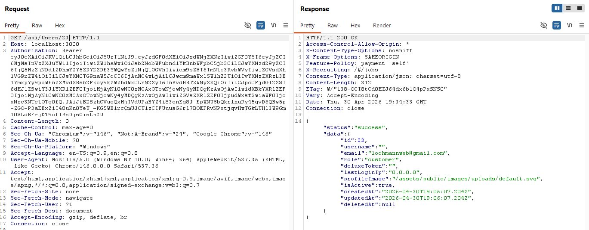
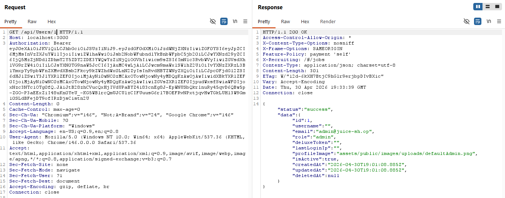

## IDOR Test – Juice Shop

### Setup
- Check Docker installation:
  docker -v

- Start the application:
  docker run -d -p 3000:3000 bkimminich/juice-shop

Then I opened the application in the browser:
http://localhost:3000

---

### IDOR Test

I found an endpoint:
GET /api/Users/23

To access data, a valid Authorization token (Bearer) was required, which I obtained by logging in.

#### What I did:
- Intercepted the request in :contentReference[oaicite:1]{index=1}  
- Used my own Authorization token  
- Modified the user ID in the request:  
  /api/Users/23 → /api/Users/1  

#### /api/Users/23
 

#### /api/Users/1

#### Result:
- I was able to access another user's data  

#### Why this is a problem:
The application does not verify whether the user making the request is authorized to access the requested data.