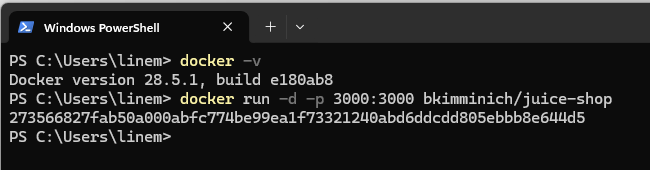

## SQL Injection -> Authentication Bypass -> Admin access 
### Summary
Identified a SQL injection vulnerability in the login endpoint allowing authentication bypass.

### Payload Used
' OR 1=1--

### Exploitation Steps
1. Intercepted login request using Burp Suite
2. Injected payload in email field  
3. Received valid authentication token
4. Accessed admin endpoint using token:
   GET /rest/admin/application-configuration 

### Result
Successfully accessed admin-only configuration data.

### Impact
- Unauthorized access to admin functionality
- Potential full system compromise

### Tools
- Burp Suite (Proxy + Repeater)

### Note
Initial response returned HTTP 304 due to caching headers. Removing the `If-None-Match` header revealed full response. 
