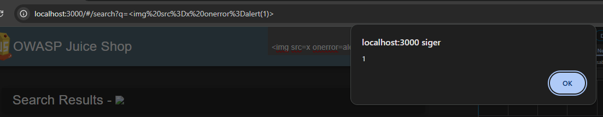

## XSS → JavaScript Execution (Search)

### Summary
I found a Cross-Site Scripting (XSS) vulnerability in the search bar, where I was able to run JavaScript in the browser.

### Payload used

### What I did
1. Wrote the payload in the search field
2. Saw that my input was shown on the page
3. Tried different payloads until something worked
4. The alert popped up → meaning the code actually ran

### Result
- I got a popup (alert), so JavaScript is running
- This means I can execute code in the user's browser  

### Impact
- Can run scripts as the user
- Could trick the user or steal data
- Could send requests as the user

### Extra test
I also tried:

And I could see some cookies:
- language
- welcomebanner_status
- continueCode

So not all cookies are protected (not HttpOnly)

### Why it works
The app shows user input directly on the page without cleaning it properly.

### Tools
- Browser
- OWASP Juice Shop